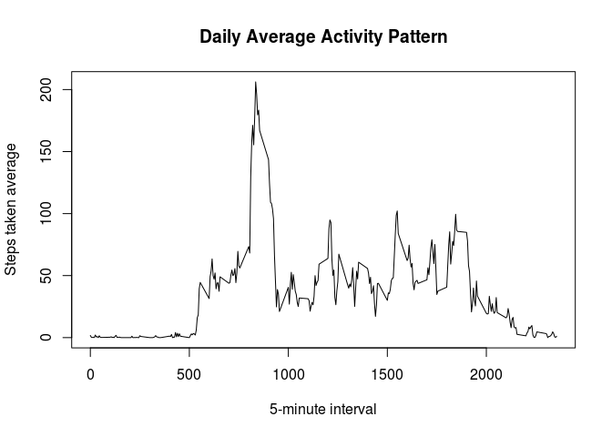

# Reproducible Research: Peer Assessment 1
Luiz Carlos Moutinho Pataca  
December 14, 2016  


## Loading and preprocessing the data


```r
#Loading compressed file "activity.zip" with read.csv() function, and defining
#class for each variable.
activity <- read.csv(file = unzip(zipfile = "activity.zip", files = "activity.csv"),
                     header = TRUE, na.strings = "NA",
                     colClasses = c("integer", "Date", "integer"))
```

## What is mean total number of steps taken per day?


```r
# Calculating total number of steps taken per day. Missing values are ignored.
total_day <- aggregate(activity$steps, by = list(activity$date), sum)
names(total_day) <- c("date", "steps")
```


```r
# Creating a histogram of total number of steps taken each day.
hist(total_day$steps,
     main = "Histogram of Total Number of Steps Taken Each Day",
     xlab = "Steps")
```

<!-- -->


```r
# Calculating and reporting the mean and median of the total number of steps
# taken per day.
Mean <- mean(total_day$steps, na.rm = TRUE)
Median <- median(total_day$steps, na.rm = TRUE)

library(knitr)
kable(cbind(Mean, Median),
      caption = "Mean and Median of the total number of steps taken per day",
      align = c("l", "l"))
```


Table: Mean and Median of the total number of steps taken per day

Mean       Median 
---------  -------
10766.19   10765  


## What is the average daily activity pattern?

Using  function aggregate() for calculating 5-minute interval mean across all days.


```r
daily_mean <- aggregate(x = activity$steps, by = list(activity$interval),
                        FUN = "mean", na.rm = TRUE)
names(daily_mean) <- c("interval", "steps")

# Ploting daily average
plot(x = daily_mean$interval, y = daily_mean$steps, type = "l",
     xlab = "5-minute interval", ylab = "Steps taken average",
     main = "Daily Average Activity Pattern")
```

<!-- -->

Determining the 5-minute interval with the largest number of steps.


```r
id_max <- which.max(daily_mean$steps)
Interval_max <- daily_mean$interval[id_max]
```

***5-minute Interval with maximum number of steps: 835***

## Imputing missing values

Calculating and reporting the total number of missing values in the dataset.


```r
missing_values <- sum(is.na(activity$steps))
```

***Total missing values in the dataset: 2304***

Using 5-minute interval total average for filling missing values in the dataset.


```r
activity_fill <- merge(x = activity, y = daily_mean, by="interval", suffixes=c("",".mean"))
id_na <- is.na(activity_fill$steps)
activity_fill$steps[id_na] <- activity_fill$steps.mean[id_na]
activity_fill <- activity_fill[order(activity_fill$date, activity_fill$interval), c(2, 3, 1)]
activity_fill$steps <- as.integer(round(x = activity_fill$steps, digits = 0))
```

**Properties and Summary of original dataset**


```r
str(activity)
```

```
## 'data.frame':	17568 obs. of  3 variables:
##  $ steps   : int  NA NA NA NA NA NA NA NA NA NA ...
##  $ date    : Date, format: "2012-10-01" "2012-10-01" ...
##  $ interval: int  0 5 10 15 20 25 30 35 40 45 ...
```

```r
summary(activity)
```

```
##      steps             date               interval     
##  Min.   :  0.00   Min.   :2012-10-01   Min.   :   0.0  
##  1st Qu.:  0.00   1st Qu.:2012-10-16   1st Qu.: 588.8  
##  Median :  0.00   Median :2012-10-31   Median :1177.5  
##  Mean   : 37.38   Mean   :2012-10-31   Mean   :1177.5  
##  3rd Qu.: 12.00   3rd Qu.:2012-11-15   3rd Qu.:1766.2  
##  Max.   :806.00   Max.   :2012-11-30   Max.   :2355.0  
##  NA's   :2304
```

**Properties and Summary of dataset with filled missing values**


```r
str(activity_fill)
```

```
## 'data.frame':	17568 obs. of  3 variables:
##  $ steps   : int  2 0 0 0 0 2 1 1 0 1 ...
##  $ date    : Date, format: "2012-10-01" "2012-10-01" ...
##  $ interval: int  0 5 10 15 20 25 30 35 40 45 ...
```

```r
summary(activity_fill)
```

```
##      steps             date               interval     
##  Min.   :  0.00   Min.   :2012-10-01   Min.   :   0.0  
##  1st Qu.:  0.00   1st Qu.:2012-10-16   1st Qu.: 588.8  
##  Median :  0.00   Median :2012-10-31   Median :1177.5  
##  Mean   : 37.38   Mean   :2012-10-31   Mean   :1177.5  
##  3rd Qu.: 27.00   3rd Qu.:2012-11-15   3rd Qu.:1766.2  
##  Max.   :806.00   Max.   :2012-11-30   Max.   :2355.0
```

Calculating total number of steps taken per day. Missing values are filled in.


```r
total_day_fill <- aggregate(activity_fill$steps, by = list(activity_fill$date), sum)
names(total_day_fill) <- c("date", "steps")
```

Creating a histogram of total number of steps taken each day. Missing values are filled in.


```r
hist(total_day_fill$steps,
     main = "Histogram of Total Number of Steps Taken Each Day",
     xlab = "Steps")
```

<!-- -->

Calculating and reporting the mean and median of the total number of steps taken per day. Missing values are filled in.


```r
Mean <- mean(total_day_fill$steps, na.rm = TRUE)
Median <- median(total_day_fill$steps, na.rm = TRUE)

library(knitr)
kable(cbind(Mean, Median),
      caption = "Mean and Median of the total number of steps taken per day. Missing values are filled in.",
      align = c("l", "l"))
```


Table: Mean and Median of the total number of steps taken per day. Missing values are filled in.

Mean       Median 
---------  -------
10765.64   10762  


The histogram and calculated values of Mean and Median show that the impact of imputing missing data on the estimates of the total daily number of steps is rather low.

## Are there differences in activity patterns between weekdays and weekends?


```r
# First defining english locale
Sys.setlocale(category = "LC_ALL", locale = "en_US.UTF-8")
```

```
## [1] "LC_CTYPE=en_US.UTF-8;LC_NUMERIC=C;LC_TIME=en_US.UTF-8;LC_COLLATE=en_US.UTF-8;LC_MONETARY=en_US.UTF-8;LC_MESSAGES=pt_BR.UTF-8;LC_PAPER=pt_BR.UTF-8;LC_NAME=C;LC_ADDRESS=C;LC_TELEPHONE=C;LC_MEASUREMENT=pt_BR.UTF-8;LC_IDENTIFICATION=C"
```

```r
# Creating a new factor variable indicating whether a given date is a weekday or
# weekend day
weekday <- weekdays(activity_fill$date)
id_weekend <- which(weekday == "Saturday" | weekday == "Sunday")
weekday[id_weekend] <- "weekend"
weekday[-id_weekend] <- "weekday"
activity_fill$weekday <- as.factor(weekday)
# Calculating total average of number of steps for weekdays and weekends
total_weekday <- aggregate(steps ~ interval + weekday, data = activity_fill, mean)
# Plotting
library("lattice")
xyplot(steps ~ interval | weekday, total_weekday, type = "l", layout = c(1, 2), 
    xlab = "Interval", ylab = "Average of steps")
```

<!-- -->

The plots show differences between weekdays and weekends. On weekdays more steps are taken before 10:00 am compared to weekends.
